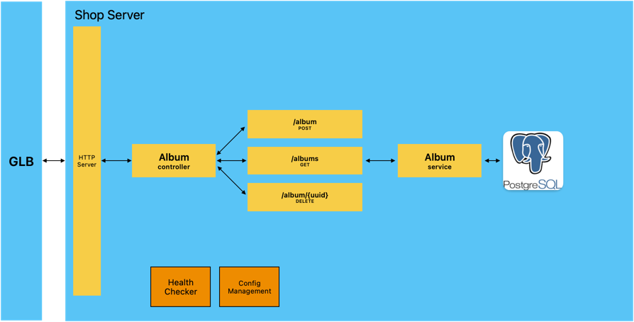

# Shop Server - golang app with different test approach examples

[](https://github.com/hubzaj/golang/tree/main#working-with-terminal)
[](https://hub.docker.com/r/hubertzajac6/shop)

## Background

The main goal of this project was to create simple shop server application written in Golang with all automation test support.
- API has been designed and implemented in [Gin framework](https://pkg.go.dev/github.com/gin-gonic/gin).
- Component test framework was implemented in [testing](https://pkg.go.dev/testing)
- Deployment configuration (Helm Charts for kubernetes deployment) was handled in a way to support on-demand testing approach.
- App has been dockerized and allows to work in container development environment (docker-compose)

** By **component test** I mean tests that are something between integration and unit tests. 
Tests required app to being run, then sending requests the same as integration tests but all the external calls are handled by stubs.
Thanks to that the tests are very fast and allow of debugging application source code which improves and speed up development as they can be run locally in the same way as unit tests.

## Architecture



## How to build project

Requirements:

-     golang 1.20.5

### How to run

* Run on local machine 
  * `make run`
* Run in container development environment 
  * `make start-container-development-environment`
    * Teardown steps to proceed: 
      * `make stop-container-development-environment`
* Run locally in the kubernetes cluster:
  * `make minikube-start`
  * `make on-demand-deploy`
  * `make on-demand-shop-service-url`
  * Teardown steps to proceed:
    * `make on-demand-cleanup`
    * `make minikube-cleanup`

### Working with terminal

1. Install `asdf` with required plugins.

 ```
  > brew install asdf
  > asdf plugin-add golang
  > asdf install
 ```

### Configuration

Configuration is designed in a way to be controlled by json file stored in `/config` directory or by the environment variables.
At the beginning config from json file is being loaded, then it is overridden by environment variables if provided.
Mainly for the component-test purpose there is also an option to control configuration by the predefined structs.
