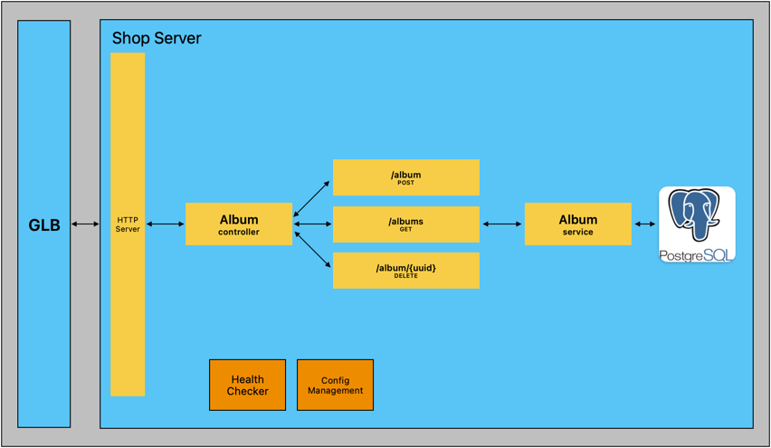

# Shop Server

[](https://github.com/hubzaj/shop-test)
[](https://github.com/hubzaj/golang/tree/main#working-with-terminal)
[](https://hub.docker.com/r/hubertzajac6/shop)

## Background

This project aimed to create a simple shop server application in Golang with robust automation test support.
- The API was built using the [Gin framework](https://pkg.go.dev/github.com/gin-gonic/gin)
- component test framework was implemented with the [testing package](https://pkg.go.dev/testing)
- Deployment configuration, managed through Helm Charts for Kubernetes deployment, was designed to support an on-demand testing approach
- The app is dockerized, allowing easy operation in a container development environment using docker-compose

** **component-tests** are a hybrid between integration and unit tests. 
They rely on the app being active to send requests, similar to integration tests. 
However, they handle all external calls to the shop service using stubs. 
This setup makes the tests fast and helps in debugging the application source code. 
This improvement speeds up development, allowing for local test execution, much like unit tests.

## Architecture

###### Album


## How to build project

Requirements:

-     golang 1.20.5

### How to run

After the service is running, you can interact with it using HTTP scripts located in the `scripts/http` directory.

* Local Machine Execution: `make run`
* Containerized Development Environment: `make start-container-development-environment`
  * To Teardown: `make stop-container-development-environment`
* Local Execution in the Kubernetes Cluster:
  * Start Minikube: `make minikube-start`
    * Ensure that you have run `eval $(minikube docker-env)` in the terminal and built the `shop-service` image afterward
  * Deploy: `make on-demand-deploy-env-router`
  * Deploy: `make on-demand-deploy`
  * Get Env Router URL: `make on-demand-env-router-url`
  * **To Teardown**:
    * Cleanup: `make on-demand-teardown`
    * Stop Minikube: `make minikube-teardown`
### Working with terminal

1. Install `asdf` with required plugins.

 ```
  > brew install asdf
  > asdf plugin-add golang
  > asdf install
 ```

### Configuration

The configuration can be controlled through a JSON file in the `/config` directory or via environment variables.
It first loads from the JSON file and then gets overridden by any provided environment variables.
Specifically for component tests, there's an option to manage the configuration using predefined structs.
